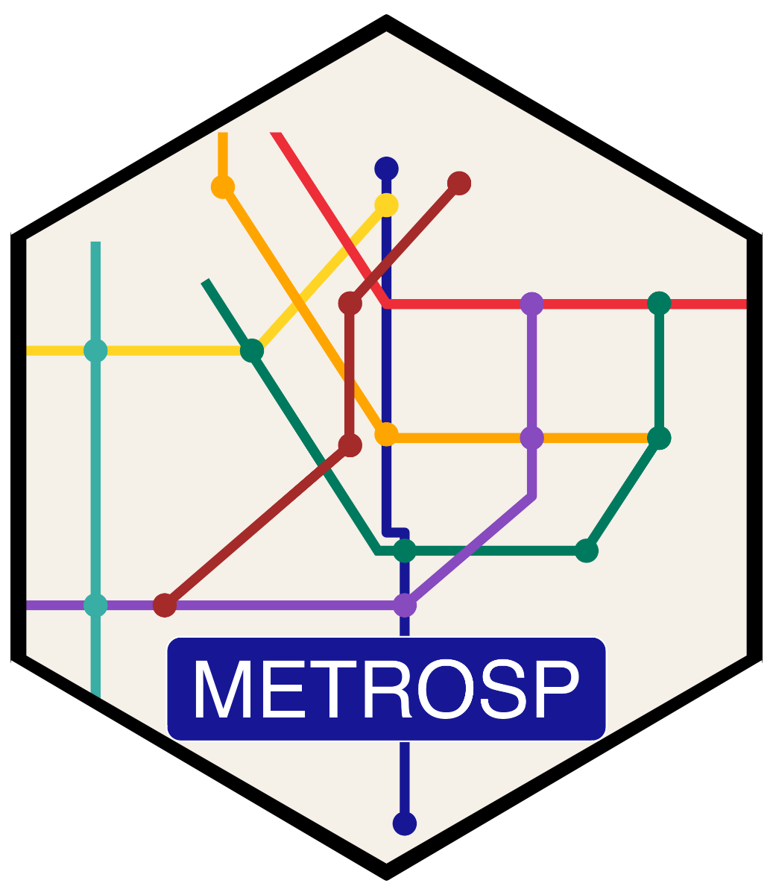

<!-- README.md is generated from README.Rmd. Please edit that file -->

# metrosp: metro ridership in São Paulo 

This packages helps distribute demanda data from the São Paulo metro
system inside R. Data is sourced from multiple operators and spans
2012-2025. While most of the data is already
[public](https://transparencia.metrosp.com.br/dataset/demanda), it’s
scattered across multiple poorly structured CSV/PDF files.

Information on lines 1, 2, 3, 5, and 15 are sourced from the open data
portal from METRÔ, while lines 4 and 5 (post-2018) are sourced from
Insper’s Dataverse.

All datasets are returned as `tibble` objects and are “lazy” datasets,
meaning they are bundled with the package and don’t need to be
downloaded. The data is also cleaned and standardized to make it easier
to work with.

## Line Coverage

The package currently covers all metro lines in São Paulo. In the future
it may be expanded to include trains as well.

<table>
<thead>
<tr>
<th style="text-align: right;">Line</th>
<th>Name</th>
<th>Operator</th>
<th>Period</th>
<th>Status</th>
</tr>
</thead>
<tbody>
<tr>
<td style="text-align: right;">1</td>
<td>Azul (Blue)</td>
<td>METRÔ</td>
<td>2017–2025</td>
<td>Available</td>
</tr>
<tr>
<td style="text-align: right;">2</td>
<td>Verde (Green)</td>
<td>METRÔ</td>
<td>2017–2025</td>
<td>Available</td>
</tr>
<tr>
<td style="text-align: right;">3</td>
<td>Vermelha (Red)</td>
<td>METRÔ</td>
<td>2017–2025</td>
<td>Available</td>
</tr>
<tr>
<td style="text-align: right;">4</td>
<td>Amarela (Yellow)</td>
<td>ViaQuatro</td>
<td>2012–2025</td>
<td>Available</td>
</tr>
<tr>
<td style="text-align: right;">5</td>
<td>Lilás (Lilac)</td>
<td>ViaMobilidade</td>
<td>2017–2025</td>
<td>Available</td>
</tr>
<tr>
<td style="text-align: right;">15</td>
<td>Prata (Silver)</td>
<td>METRÔ</td>
<td>2017–2025</td>
<td>Available</td>
</tr>
</tbody>
</table>

## Installation

The package will be available on CRAN. Once released, install with:

    install.packages("metrosp")

To install the development version from GitHub, use:

    # install.packages("remotes")
    remotes::install_github("viniciusoike/metrosp")

## Datasets

The table below describes all datasets that are shipped with the
package. The main datasets are: `passengers_entrance`,
`passengers_transported`, `station_averages`, and `station_daily`. Other
datasets are auxiliary tables aimed at facilitating analysis and
visualization.

<table>
<colgroup>
<col style="width: 25%" />
<col style="width: 54%" />
<col style="width: 10%" />
<col style="width: 8%" />
</colgroup>
<thead>
<tr>
<th>Dataset</th>
<th>Description</th>
<th>Frequency</th>
<th>Spatial</th>
</tr>
</thead>
<tbody>
<tr>
<td><code>passengers_entrance</code></td>
<td>Average passenger entries by line</td>
<td>Monthly</td>
<td>No</td>
</tr>
<tr>
<td><code>passengers_transported</code></td>
<td>Average passengers transported by line</td>
<td>Monthly</td>
<td>No</td>
</tr>
<tr>
<td><code>station_averages</code></td>
<td>Average weekday passenger entries by station</td>
<td>Monthly</td>
<td>No</td>
</tr>
<tr>
<td><code>station_daily</code></td>
<td>Daily passenger entries by station</td>
<td>Daily</td>
<td>No</td>
</tr>
<tr>
<td><code>metro_lines</code></td>
<td>Metro line reference table (names, colors, operators)</td>
<td>—</td>
<td>No</td>
</tr>
<tr>
<td><code>metro_colors</code></td>
<td>Named vector of official metro line colors</td>
<td>—</td>
<td>No</td>
</tr>
<tr>
<td><code>lines</code></td>
<td>Metro and train line routes (current + planned)</td>
<td>—</td>
<td>Yes</td>
</tr>
<tr>
<td><code>stations</code></td>
<td>Metro and train station locations (current + planned)</td>
<td>—</td>
<td>Yes</td>
</tr>
</tbody>
</table>

## Usage

    library(metrosp)
    # To work with spatial datasets (lines, stations)
    library(sf)
    # For better tables load dplyr or tibble
    library(dplyr)

    # Passenger entries by line
    passengers_entrance

    # Station-level weekday averages
    station_averages

    # Spatial line routes
    lines

## Data sources

- METRÔ: [Companhia do Metropolitano de São Paulo
  (METRO)](https://transparencia.metrosp.com.br/dataset/demanda).
- Lines 4/5 data: [Insper
  Dataverse](https://doi.org/10.60873/FK2/UTGQ0I) (ViaQuatro /
  ViaMobilidade).
- Spatial data: [GeoSampa, Prefeitura de São
  Paulo](https://geosampa.prefeitura.sp.gov.br/).
