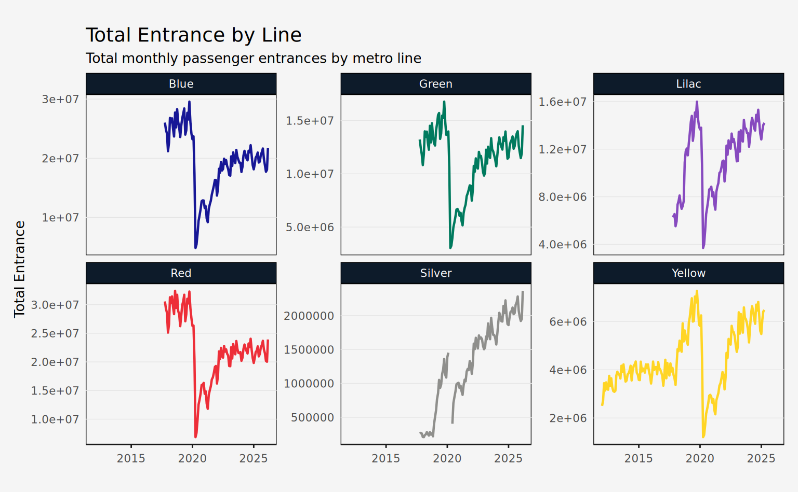
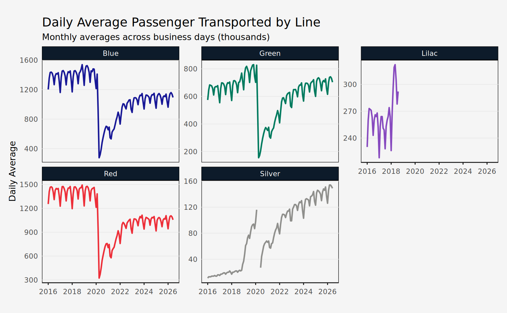
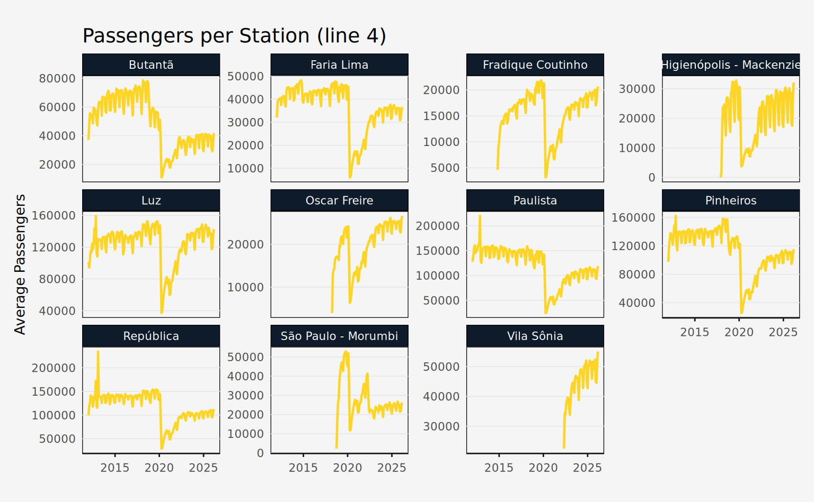
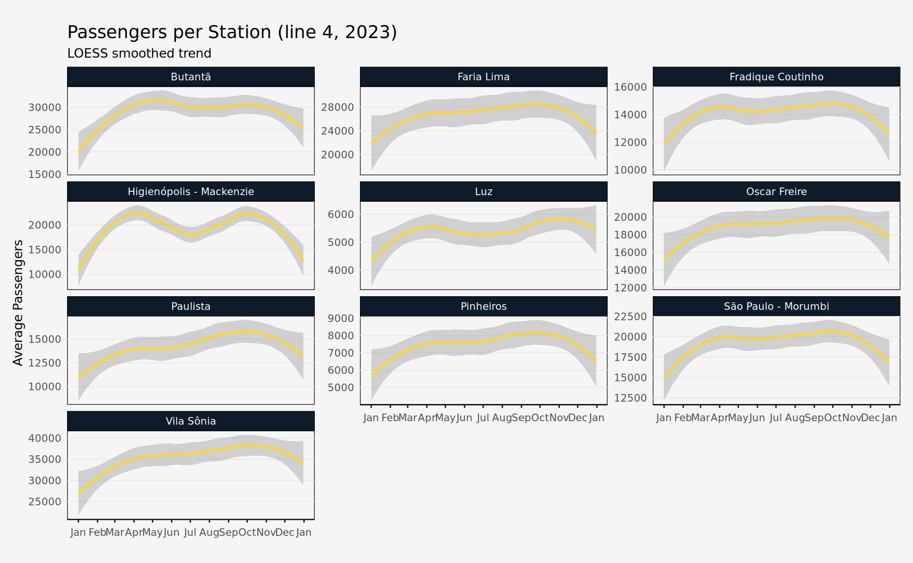

# Getting Started

## metrosp

The `metrosp` package provides access to the [Metro de São
Paulo](https://transparencia.metrosp.com.br/) public transportation
data. Since the data is not updated regularly and the datasets are
rather compact, this package distributes the data in a “lazy” format.
This means that all data comes prepackaged and is called directly,
without needing to download or import the raw data.

``` r

library(metrosp)
library(dplyr)
```

There are four main datasets:

- `passengers_entrance`: daily passengers entering the metro system
- `passengers_transported`: daily passengers transported by the metro
  system
- `station_averages`: daily average passengers per station
- `station_daily`: daily passengers per station

For convenience, `metrosp` also provides information on stations and
lines of the metro system (`lines`, `stations`, and `metro_lines`). The
`lines` dataset is a spatial dataset and requires the `sf` package to
work properly.

``` r

library(sf)

lines
#> Simple feature collection with 55 features and 6 fields
#> Geometry type: GEOMETRY
#> Dimension:     XY
#> Bounding box:  xmin: -46.98358 ymin: -23.77875 xmax: -46.18294 ymax: -23.19513
#> Geodetic CRS:  WGS 84
#> First 10 features:
#>     status company_name line_number  type line_name_pt line_name
#> 1  current        Metrô           1 metro         Azul      Blue
#> 2  current        Metrô           2 metro        Verde     Green
#> 3  current        Metrô           3 metro     Vermelha       Red
#> 4  current        Metrô           5 metro        Lilás     Lilac
#> 5  current        Metrô          15 metro        Prata    Silver
#> 6  current    ViaQuatro           4 metro      Amarela    Yellow
#> 7   future        Metrô           2 metro        Verde     Green
#> 8   future        Metrô           2 metro        Verde     Green
#> 9   future        Metrô           2 metro        Verde     Green
#> 10  future        Metrô          15 metro        Prata    Silver
#>                              geom
#> 1  LINESTRING (-46.60291 -23.4...
#> 2  LINESTRING (-46.69089 -23.5...
#> 3  LINESTRING (-46.66754 -23.5...
#> 4  LINESTRING (-46.63049 -23.5...
#> 5  LINESTRING (-46.5838 -23.58...
#> 6  LINESTRING (-46.63449 -23.5...
#> 7  LINESTRING (-46.54846 -23.4...
#> 8  LINESTRING (-46.54283 -23.5...
#> 9  LINESTRING (-46.7015 -23.54...
#> 10 LINESTRING (-46.46899 -23.5...
```

Finally, the package also provides a named vector of colors for each
line of the metro system (`metro_colors`).

``` r

metro_colors
#>      Blue     Green       Red    Yellow     Lilac    Silver 
#> "#171796" "#007A5E" "#ED2E38" "#FFD525" "#874ABF" "#8F8F8C"
```

Using the datasets is straightforward, just call the dataset name.

``` r

glimpse(passengers_entrance)
#> Rows: 3,730
#> Columns: 9
#> $ date         <date> 2012-01-01, 2012-01-01, 2012-01-01, 2012-01-01, 2012-01-…
#> $ line_number  <dbl> 4, 4, 4, 4, 4, 4, 4, 4, 4, 4, 4, 4, 4, 4, 4, 4, 4, 4, 4, …
#> $ metric_abb   <chr> "max", "mdo", "mdu", "msa", "total", "max", "mdo", "mdu",…
#> $ value        <dbl> 48112.00, 4932.68, 19867.93, 9775.25, 2504294.00, 53328.0…
#> $ metric       <chr> "Daily Peak", "Average on Sundays", "Average on Business …
#> $ metric_pt    <chr> "Máxima Diária", "Média dos Domingos", "Média dos Dias Út…
#> $ line_name    <chr> "Yellow", "Yellow", "Yellow", "Yellow", "Yellow", "Yellow…
#> $ line_name_pt <chr> "Amarela", "Amarela", "Amarela", "Amarela", "Amarela", "A…
#> $ year         <dbl> 2012, 2012, 2012, 2012, 2012, 2012, 2012, 2012, 2012, 201…
```

All datasets are returned as `tibble` so using the `dplyr` package is
recommended.

## The datasets

This tutorial will briefly introduce the main datasets and how to use
them by making simple visualizations with the data. To better replicate
the visualization, use the `ggplot2` package and the custom theme below.

Code

``` r

library(ggplot2)

theme_series <- theme_minimal(base_family = "Avenir", base_size = 10) +
  theme(
    panel.background = element_rect(fill = "#f5f5f5"),
    plot.background = element_rect(fill = "#f5f5f5"),
    plot.margin = margin(20, 10, 20, 10),
    plot.title = element_text(family = "Lora", size = 14),
    panel.grid.minor = element_blank(),
    panel.grid.major.x = element_blank(),
    panel.grid.major.y = element_line(color = "gray90", linewidth = 0.25),
    axis.title.x = element_blank(),
    axis.line.x = element_line(color = "gray10", linewidth = 0.5),
    axis.ticks.x = element_line(color = "gray10", linewidth = 0.5),
    strip.background = element_rect(fill = "#0D1B2A"),
    strip.text = element_text(color = "#ffffff"),
    legend.position = "bottom"
  )
```

### Entrance and Transported

The `passengers_entrance` and `passengers_transported` datasets are both
monthly passengers entering and transported by the metro system. The
former is a daily count of passengers entering the metro system, while
the latter is a daily count of passengers transported by the metro
system.

The data is aggregated into metrics:

- `max`: maximum number of passengers (daily peak)
- `mdu`: average number of passengers on business days
- `mdo`: average number of passengers on Sundays
- `msa`: average number of passengers on Saturdays
- `total`: total number of passengers

#### Entrance

This dataset is identified by month (`date`), line (`line_number`,
`line_name`), and metric (`metric_abb`, `metric`). The data is in tidy
format.

``` r

glimpse(passengers_entrance)
#> Rows: 3,730
#> Columns: 9
#> $ date         <date> 2012-01-01, 2012-01-01, 2012-01-01, 2012-01-01, 2012-01-…
#> $ line_number  <dbl> 4, 4, 4, 4, 4, 4, 4, 4, 4, 4, 4, 4, 4, 4, 4, 4, 4, 4, 4, …
#> $ metric_abb   <chr> "max", "mdo", "mdu", "msa", "total", "max", "mdo", "mdu",…
#> $ value        <dbl> 48112.00, 4932.68, 19867.93, 9775.25, 2504294.00, 53328.0…
#> $ metric       <chr> "Daily Peak", "Average on Sundays", "Average on Business …
#> $ metric_pt    <chr> "Máxima Diária", "Média dos Domingos", "Média dos Dias Út…
#> $ line_name    <chr> "Yellow", "Yellow", "Yellow", "Yellow", "Yellow", "Yellow…
#> $ line_name_pt <chr> "Amarela", "Amarela", "Amarela", "Amarela", "Amarela", "A…
#> $ year         <dbl> 2012, 2012, 2012, 2012, 2012, 2012, 2012, 2012, 2012, 201…
```

Note that a special line was defined to aggregate the total of the METRÔ
system (`line_name = "METRO System"` or `line_num = 99`). For most uses,
it’s best to filter out this line.

``` r

total_entrance <- passengers_entrance |>
  filter(metric_abb == "total", line_name != "METRO System")
```

The plot shows the total monthly passenger entrances by metro line. Note
that the line-5 series is interrupted since the ownership of the line
was transferred to ViaMobilidade in 2018.

Code

``` r

ggplot(total_entrance, aes(x = date, y = value, color = line_name)) +
  geom_line(lwd = 0.8) +
  facet_wrap(vars(line_name), scales = "free_y") +
  scale_color_manual(values = metro_colors) +
  guides(color = "none") +
  labs(
    title = "Total Entrance by Line",
    subtitle = "Total monthly passenger entrances by metro line",
    x = NULL,
    y = "Total Entrance"
  ) +
  theme_series
```



#### Transported

This dataset is identified by month (`date`), line (`line_number`,
`line_name`), and metric (`metric_abb`, `metric`). The data is in tidy
format. It has the same columns as `passengers_entrance` which is
**thousands of passengers**. Also, this dataset currently only includes
data on the METRÔ operated system. In the future, this dataset may be
expanded to include lines 4 and 5.

``` r

glimpse(passengers_transported)
#> Rows: 2,550
#> Columns: 9
#> $ date         <date> 2017-10-01, 2017-10-01, 2017-10-01, 2017-10-01, 2017-10-…
#> $ line_number  <dbl> 1, 1, 1, 1, 1, 2, 2, 2, 2, 2, 3, 3, 3, 3, 3, 5, 5, 5, 5, …
#> $ metric_abb   <chr> "max", "mdo", "mdu", "msa", "total", "max", "mdo", "mdu",…
#> $ value        <dbl> 1506, 422, 1432, 788, 35446, 718, 179, 696, 301, 16637, 1…
#> $ metric       <chr> "Daily Peak", "Average on Sundays", "Average on Business …
#> $ metric_pt    <chr> "Máxima Diária", "Média dos Domingos", "Média dos Dias Út…
#> $ line_name    <chr> "Blue", "Blue", "Blue", "Blue", "Blue", "Green", "Green",…
#> $ line_name_pt <chr> "Azul", "Azul", "Azul", "Azul", "Azul", "Verde", "Verde",…
#> $ year         <dbl> 2017, 2017, 2017, 2017, 2017, 2017, 2017, 2017, 2017, 201…
```

Note that a special line was defined to aggregate the total of the METRÔ
system (`line_name = "METRO System"` or `line_num = 99`). For most uses,
it’s best to filter out this line.

``` r

daily_avg <- passengers_transported |>
  filter(metric_abb == "mdu", line_number != 99)
```

The plot below shows the daily average (business days) passenger
transported by metro line.

Code

``` r

ggplot(daily_avg, aes(x = date, y = value, color = line_name)) +
  geom_line(lwd = 0.8) +
  facet_wrap(vars(line_name), scales = "free_y") +
  scale_color_manual(values = metro_colors) +
  labs(
    title = "Daily Average Passenger Transported by Line",
    subtitle = "Monthly averages across business days (thousands)",
    x = NULL,
    y = "Daily Average"
  ) +
  guides(color = "none") +
  theme_series
```



### Station Averages

This dataset is identified by month (`date`), line (`line_number`,
`line_name`), and station (`station_name`). The only value column
available is `avg_passenger`, which is the daily average (business days)
of passengers entering the station.

``` r

glimpse(station_averages)
#> Rows: 9,162
#> Columns: 7
#> $ date          <date> 2012-01-01, 2012-01-01, 2012-01-01, 2012-01-01, 2012-01…
#> $ line_number   <dbl> 4, 4, 4, 4, 4, 4, 4, 4, 4, 4, 4, 4, 4, 4, 4, 4, 4, 4, 4,…
#> $ station_name  <chr> "Butantã", "Faria Lima", "Luz", "Paulista", "Pinheiros",…
#> $ avg_passenger <dbl> 37066.82, 31989.09, 100889.32, 127844.59, 97537.45, 9919…
#> $ line_name     <chr> "Yellow", "Yellow", "Yellow", "Yellow", "Yellow", "Yello…
#> $ line_name_pt  <chr> "Amarela", "Amarela", "Amarela", "Amarela", "Amarela", "…
#> $ year          <dbl> 2012, 2012, 2012, 2012, 2012, 2012, 2012, 2012, 2012, 20…
```

The plot below shows the daily average (business days) passengers
entering each station of line 4. Note that the temporal range of the
data is unequal across stations, since not all of them were inaugurated
at the same time.

Code

``` r

line4st <- station_averages |>
  filter(line_number == 4)

ggplot(line4st, aes(x = date, y = avg_passenger)) +
  geom_line(lwd = 0.8, color = metro_colors["Yellow"]) +
  facet_wrap(vars(station_name), scales = "free_y") +
  labs(
    x = NULL,
    y = "Average Passengers",
    title = "Passengers per Station (line 4)"
  ) +
  theme_series
```



### Station Daily

This dataset is identified by day (`date`), line (`line_number`,
`line_name`), and station (`station_name`). The only value column
available is `passengers`, which is the daily number of passengers
entering the station. Additionally, the column `station_code` contains
three letter abbreviations for stations, but only for METRÔ operated
lines.

``` r

glimpse(station_daily)
#> Rows: 220,882
#> Columns: 8
#> $ date         <date> 2012-01-01, 2012-01-01, 2012-01-01, 2012-01-01, 2012-01-…
#> $ line_number  <dbl> 4, 4, 4, 4, 4, 4, 4, 4, 4, 4, 4, 4, 4, 4, 4, 4, 4, 4, 4, …
#> $ station_name <chr> "Butantã", "Faria Lima", "Luz", "Paulista", "Pinheiros", …
#> $ passengers   <dbl> 7742, 4737, 695, 2277, 332, 25317, 21930, 3923, 14356, 39…
#> $ line_name    <chr> "Yellow", "Yellow", "Yellow", "Yellow", "Yellow", "Yellow…
#> $ line_name_pt <chr> "Amarela", "Amarela", "Amarela", "Amarela", "Amarela", "A…
#> $ station_code <chr> NA, NA, NA, NA, NA, NA, NA, NA, NA, NA, NA, NA, NA, NA, N…
#> $ year         <dbl> 2012, 2012, 2012, 2012, 2012, 2012, 2012, 2012, 2012, 201…
```

The plot below shows the trend of daily passengers entering each station
of line 4 in 2023.

Code

``` r

line4st_daily <- station_daily |>
  filter(line_number == 4, year == 2023)

ggplot(line4st_daily, aes(x = date, y = passengers)) +
  geom_smooth(
    lwd = 0.8,
    color = metro_colors["Yellow"],
    method = "loess",
    span = 0.65
  ) +
  facet_wrap(vars(station_name), scales = "free_y", ncol = 3) +
  scale_x_date(date_breaks = "1 month", date_labels = "%b") +
  labs(
    title = "Passengers per Station (line 4, 2023)",
    subtitle = "LOESS smoothed trend",
    x = NULL,
    y = "Average Passengers"
  ) +
  theme_series
```


