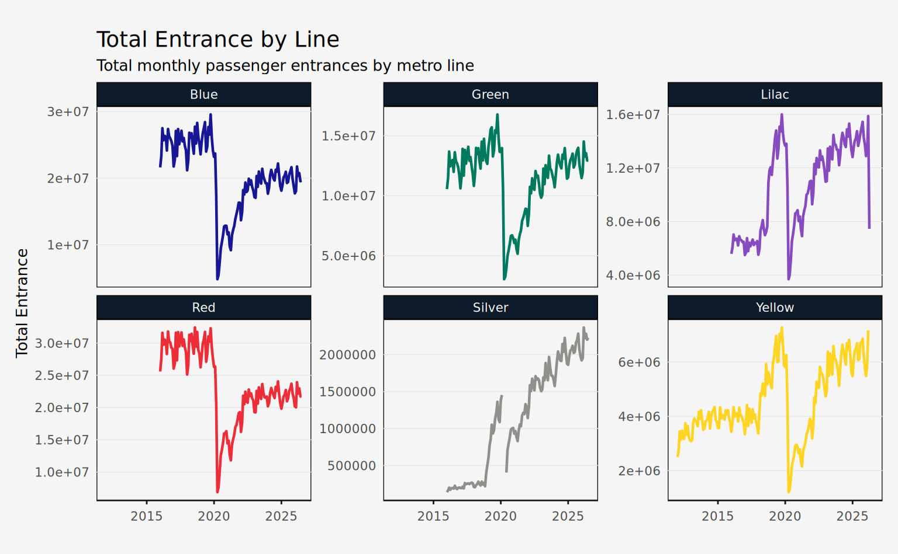
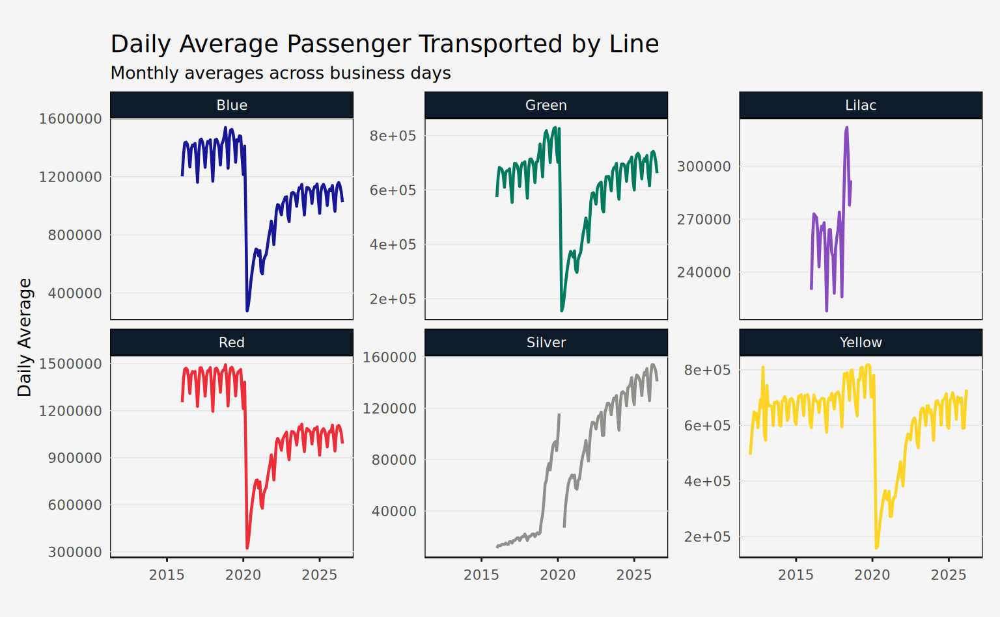
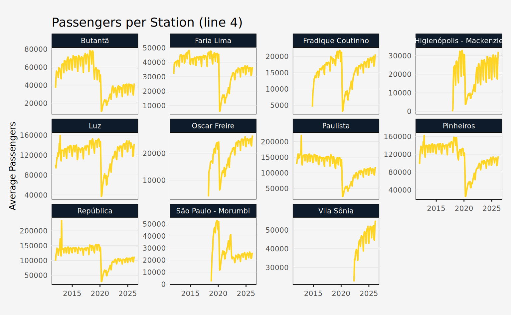
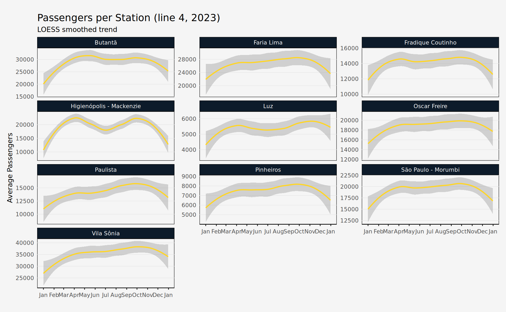

# Getting Started

## metrosp

The `metrosp` package provides access to the [Metro de São
Paulo](https://transparencia.metrosp.com.br/) public transportation
data. The datasets are compact and the sources publish irregularly, so
the package ships the data in a “lazy” format. All data comes
prepackaged and is called directly, with no download or import step.

The bundled data is a fixed snapshot, current through July 2026.
[`read_metro_demand()`](https://viniciusoike.github.io/metrosp/reference/read_metro_demand.md)
reads newer data, published separately on every pipeline run (see [Newer
data](#newer-data)).

``` r

library(metrosp)
library(dplyr)
```

There are four main datasets:

- `line_entries_monthly`: monthly passengers entering the metro system,
  by line
- `line_transported_monthly`: monthly passengers transported by the
  metro system, by line
- `station_transported_monthly`: monthly average of weekday passengers
  per station
- `station_entries_daily`: daily passengers per station

For convenience, `metrosp` also provides information on stations and
lines of the metro system (`rail_lines` and `rail_stations`). The
`rail_lines` dataset is a spatial dataset and requires the `sf` package
to work properly; it carries the line numbers and Portuguese/English
line names for the full network (including planned and CPTM lines).

``` r

library(sf)

rail_lines
#> Simple feature collection with 55 features and 6 fields
#> Geometry type: GEOMETRY
#> Dimension:     XY
#> Bounding box:  xmin: -46.98358 ymin: -23.77875 xmax: -46.18294 ymax: -23.19513
#> Geodetic CRS:  WGS 84
#> First 10 features:
#>    line_number line_name line_name_pt  company_name  type  status
#> 1            1      Blue         Azul         Metrô metro current
#> 2            2     Green        Verde         Metrô metro current
#> 3            3       Red     Vermelha         Metrô metro current
#> 4            5     Lilac        Lilás ViaMobilidade metro current
#> 5           15    Silver        Prata         Metrô metro current
#> 6            4    Yellow      Amarela     ViaQuatro metro current
#> 7            2     Green        Verde         Metrô metro  future
#> 8            2     Green        Verde         Metrô metro  future
#> 9            2     Green        Verde         Metrô metro  future
#> 10          15    Silver        Prata         Metrô metro  future
#>                              geom
#> 1  LINESTRING (-46.60291 -23.4...
#> 2  LINESTRING (-46.69089 -23.5...
#> 3  LINESTRING (-46.66754 -23.5...
#> 4  LINESTRING (-46.63049 -23.5...
#> 5  LINESTRING (-46.5838 -23.58...
#> 6  LINESTRING (-46.63449 -23.5...
#> 7  LINESTRING (-46.54846 -23.4...
#> 8  LINESTRING (-46.54283 -23.5...
#> 9  LINESTRING (-46.7015 -23.54...
#> 10 LINESTRING (-46.46899 -23.5...
```

The package also provides a named vector of colors for each line of the
metro system (`metro_colors`) and a São Paulo holiday and business-day
calendar (`calendar_spo`).

``` r

metro_colors
#>      Blue     Green       Red    Yellow     Lilac    Silver 
#> "#171796" "#007A5E" "#ED2E38" "#FFD525" "#874ABF" "#8F8F8C"
```

Using the datasets is straightforward, just call the dataset name.

``` r

glimpse(line_entries_monthly)
#> Rows: 3,990
#> Columns: 9
#> $ date           <date> 2012-01-01, 2012-01-01, 2012-01-01, 2012-01-01, 2012-0…
#> $ year           <int> 2012, 2012, 2012, 2012, 2012, 2012, 2012, 2012, 2012, 2…
#> $ line_number    <int> 4, 4, 4, 4, 4, 4, 4, 4, 4, 4, 4, 4, 4, 4, 4, 4, 4, 4, 4…
#> $ line_name      <chr> "Yellow", "Yellow", "Yellow", "Yellow", "Yellow", "Yell…
#> $ line_name_pt   <chr> "Amarela", "Amarela", "Amarela", "Amarela", "Amarela", …
#> $ metric         <chr> "max", "mdo", "mdu", "msa", "total", "max", "mdo", "mdu…
#> $ metric_name    <chr> "Daily Peak", "Average on Sundays", "Average on Busines…
#> $ metric_name_pt <chr> "Máxima Diária", "Média dos Domingos", "Média dos Dias …
#> $ value          <dbl> 122637.00, 24663.40, 99339.64, 48876.25, 2504294.00, 13…
```

All datasets are returned as `tibble` so using the `dplyr` package is
recommended.

### Newer data

The bundled snapshot stays put across package versions, so examples and
analyses remain reproducible. Fresh data goes somewhere else: every
pipeline run publishes the four demand datasets to a GitHub release.
[`read_metro_demand()`](https://viniciusoike.github.io/metrosp/reference/read_metro_demand.md)
reads from there.

``` r

# Latest published data
entrance <- read_metro_demand("line_entries_monthly")

# The month's published batch, named in the analysis that used it
entrance_sep <- read_metro_demand("line_entries_monthly", vintage = "2026-09")
```

Downloads use the platform-specific user cache returned by
[`tools::R_user_dir()`](https://rdrr.io/r/tools/userdir.html).
[`metrosp_cache()`](https://viniciusoike.github.io/metrosp/reference/metrosp_cache.md)
lists its contents and
[`metrosp_cache_clear()`](https://viniciusoike.github.io/metrosp/reference/metrosp_cache_clear.md)
removes them; set `cache = FALSE` to keep a download only for the
current session. Columns match the bundled datasets, so code written
against one works with the other.

The rest of this tutorial uses the bundled data, which needs no
download.

## The datasets

This tutorial will briefly introduce the main datasets and how to use
them by making simple visualizations with the data. To better replicate
the visualization, use the `ggplot2` package and the custom theme below.

Code

``` r

library(ggplot2)

theme_series <- theme_minimal(base_family = "Avenir", base_size = 10) +
  theme(
    panel.background = element_rect(fill = "#f5f5f5"),
    plot.background = element_rect(fill = "#f5f5f5"),
    plot.margin = margin(20, 10, 20, 10),
    plot.title = element_text(family = "Lora", size = 14),
    panel.grid.minor = element_blank(),
    panel.grid.major.x = element_blank(),
    panel.grid.major.y = element_line(color = "gray90", linewidth = 0.25),
    axis.title.x = element_blank(),
    axis.line.x = element_line(color = "gray10", linewidth = 0.5),
    axis.ticks.x = element_line(color = "gray10", linewidth = 0.5),
    strip.background = element_rect(fill = "#0D1B2A"),
    strip.text = element_text(color = "#ffffff"),
    legend.position = "bottom"
  )
```

### Entrance and Transported

Both `line_entries_monthly` and `line_transported_monthly` are monthly
series by line. An entry is a passenger crossing a turnstile; a
transported passenger is a turnstile entry plus a transfer between lines
at an interchange station, so transported counts run above entry counts
for the same line and month.

The data is aggregated into metrics:

- `max`: maximum number of passengers (daily peak)
- `mdu`: average number of passengers on business days
- `mdo`: average number of passengers on Sundays
- `msa`: average number of passengers on Saturdays
- `total`: total number of passengers

#### Entrance

This dataset is identified by month (`date`), line (`line_number`,
`line_name`), and metric (`metric`, `metric_name`). The data is in tidy
format and values are in **individual passengers**.

``` r

glimpse(line_entries_monthly)
#> Rows: 3,990
#> Columns: 9
#> $ date           <date> 2012-01-01, 2012-01-01, 2012-01-01, 2012-01-01, 2012-0…
#> $ year           <int> 2012, 2012, 2012, 2012, 2012, 2012, 2012, 2012, 2012, 2…
#> $ line_number    <int> 4, 4, 4, 4, 4, 4, 4, 4, 4, 4, 4, 4, 4, 4, 4, 4, 4, 4, 4…
#> $ line_name      <chr> "Yellow", "Yellow", "Yellow", "Yellow", "Yellow", "Yell…
#> $ line_name_pt   <chr> "Amarela", "Amarela", "Amarela", "Amarela", "Amarela", …
#> $ metric         <chr> "max", "mdo", "mdu", "msa", "total", "max", "mdo", "mdu…
#> $ metric_name    <chr> "Daily Peak", "Average on Sundays", "Average on Busines…
#> $ metric_name_pt <chr> "Máxima Diária", "Média dos Domingos", "Média dos Dias …
#> $ value          <dbl> 122637.00, 24663.40, 99339.64, 48876.25, 2504294.00, 13…
```

Because METRO line entries include transfers arriving from Lines 4 and
5, while Lines 4 and 5 count turnstiles only, summing across all six
lines counts a Line 4 → Line 1 journey twice. No clean network total
exists across operators. Do not sum `max`: individual lines may peak on
different days.

``` r

total_entrance <- line_entries_monthly |>
  filter(metric == "total")
```

The plot shows the total monthly passenger entrances by metro line. Line
4 starts in 2012 and the other lines in January 2016. July 2017 is the
one gap, a month METRO never published an entrance table for.

Code

``` r

ggplot(total_entrance, aes(x = date, y = value, color = line_name)) +
  geom_line(lwd = 0.8) +
  facet_wrap(vars(line_name), scales = "free_y") +
  scale_color_manual(values = metro_colors) +
  guides(color = "none") +
  labs(
    title = "Total Entrance by Line",
    subtitle = "Total monthly passenger entrances by metro line",
    x = NULL,
    y = "Total Entrance"
  ) +
  theme_series
```



#### Transported

This dataset has the same columns and unit as `line_entries_monthly`.
METRÔ publishes it in thousands, so values are rounded to the thousand;
Line 4 comes from the Dataverse in individual passengers.

Line 4 runs from January 2012 with all five metrics, summing turnstile
entries and transfers. Line 5 stops in August 2018, when the line passed
to ViaMobilidade: the Dataverse feed records turnstiles only, so no
transported measure exists for it afterward.

``` r

glimpse(line_transported_monthly)
#> Rows: 3,555
#> Columns: 9
#> $ date           <date> 2012-01-01, 2012-01-01, 2012-01-01, 2012-01-01, 2012-0…
#> $ year           <int> 2012, 2012, 2012, 2012, 2012, 2012, 2012, 2012, 2012, 2…
#> $ line_number    <int> 4, 4, 4, 4, 4, 4, 4, 4, 4, 4, 4, 4, 4, 4, 4, 4, 4, 4, 4…
#> $ line_name      <chr> "Yellow", "Yellow", "Yellow", "Yellow", "Yellow", "Yell…
#> $ line_name_pt   <chr> "Amarela", "Amarela", "Amarela", "Amarela", "Amarela", …
#> $ metric         <chr> "max", "mdo", "mdu", "msa", "total", "max", "mdo", "mdu…
#> $ metric_name    <chr> "Daily Peak", "Average on Sundays", "Average on Busines…
#> $ metric_name_pt <chr> "Máxima Diária", "Média dos Domingos", "Média dos Dias …
#> $ value          <dbl> 573606.0, 128101.0, 494526.9, 214406.5, 12377723.0, 665…
```

A transported passenger is counted on every line used. Summing the lines
therefore double-counts interchange journeys and should not be
interpreted as the number of unique passengers in the network.

``` r

daily_avg <- line_transported_monthly |>
  filter(metric == "mdu")
```

The plot below shows the daily average (business days) passengers
transported by metro line. The Lilac panel stops in 2018, when Line 5
left the METRÔ reports.

Code

``` r

ggplot(daily_avg, aes(x = date, y = value, color = line_name)) +
  geom_line(lwd = 0.8) +
  facet_wrap(vars(line_name), scales = "free_y") +
  scale_color_manual(values = metro_colors) +
  labs(
    title = "Daily Average Passenger Transported by Line",
    subtitle = "Monthly averages across business days",
    x = NULL,
    y = "Daily Average"
  ) +
  guides(color = "none") +
  theme_series
```



### Station Transported

This dataset is identified by month (`date`), line (`line_number`,
`line_name`), physical station (`station_id`), and the constant `mdu`
metric. `station_name` is the current display label and `value` is the
daily average on business days. It measures transported passengers —
boardings plus transfers — so grouping by `station_id` gives boardings
across a complex’s platforms, not people entering it. Line 5 covers
January 2016–July 2018 only; later station data lives in
`station_entries_daily`.

``` r

glimpse(station_transported_monthly)
#> Rows: 9,711
#> Columns: 11
#> $ date           <date> 2012-01-01, 2012-01-01, 2012-01-01, 2012-01-01, 2012-0…
#> $ year           <int> 2012, 2012, 2012, 2012, 2012, 2012, 2012, 2012, 2012, 2…
#> $ line_number    <int> 4, 4, 4, 4, 4, 4, 4, 4, 4, 4, 4, 4, 4, 4, 4, 4, 4, 4, 4…
#> $ station_id     <chr> "butanta", "faria-lima", "luz", "consolacao-paulista", …
#> $ station_name   <chr> "Butantã", "Faria Lima", "Luz", "Paulista", "Pinheiros"…
#> $ line_name      <chr> "Yellow", "Yellow", "Yellow", "Yellow", "Yellow", "Yell…
#> $ line_name_pt   <chr> "Amarela", "Amarela", "Amarela", "Amarela", "Amarela", …
#> $ metric         <chr> "mdu", "mdu", "mdu", "mdu", "mdu", "mdu", "mdu", "mdu",…
#> $ metric_name    <chr> "Average on Business Days", "Average on Business Days",…
#> $ metric_name_pt <chr> "Média dos Dias Úteis", "Média dos Dias Úteis", "Média …
#> $ value          <dbl> 37066.82, 31989.09, 100889.32, 127844.59, 97537.45, 991…
```

The plot below shows the daily average (business days) passengers
entering each station of line 4. Note that the temporal range of the
data is unequal across stations, since not all of them were inaugurated
at the same time.

Code

``` r

line4st <- station_transported_monthly |>
  filter(line_number == 4)

ggplot(line4st, aes(x = date, y = value)) +
  geom_line(lwd = 0.8, color = metro_colors["Yellow"]) +
  facet_wrap(vars(station_name), scales = "free_y") +
  labs(
    x = NULL,
    y = "Average Passengers",
    title = "Passengers per Station (line 4)"
  ) +
  theme_series
```



### Station Daily

This dataset is identified by day (`date`), line (`line_number`,
`line_name`), and physical station (`station_id`). `station_name` is the
current display label and `value` is the daily number of passengers
entering the station. Additionally, `station_code` contains three-letter
abbreviations for stations, but only for METRÔ-operated lines.

``` r

glimpse(station_entries_daily)
#> Rows: 244,174
#> Columns: 9
#> $ date         <date> 2012-01-01, 2012-01-01, 2012-01-01, 2012-01-01, 2012-01-…
#> $ year         <int> 2012, 2012, 2012, 2012, 2012, 2012, 2012, 2012, 2012, 201…
#> $ line_number  <int> 4, 4, 4, 4, 4, 4, 4, 4, 4, 4, 4, 4, 4, 4, 4, 4, 4, 4, 4, …
#> $ station_id   <chr> "butanta", "faria-lima", "luz", "consolacao-paulista", "p…
#> $ station_name <chr> "Butantã", "Faria Lima", "Luz", "Paulista", "Pinheiros", …
#> $ station_code <chr> NA, NA, NA, NA, NA, NA, NA, NA, NA, NA, NA, NA, NA, NA, N…
#> $ line_name    <chr> "Yellow", "Yellow", "Yellow", "Yellow", "Yellow", "Yellow…
#> $ line_name_pt <chr> "Amarela", "Amarela", "Amarela", "Amarela", "Amarela", "A…
#> $ value        <dbl> 7742, 4737, 695, 2277, 332, 25317, 21930, 3923, 14356, 39…
```

The plot below shows the trend of daily passengers entering each station
of line 4 in 2023.

Code

``` r

line4st_daily <- station_entries_daily |>
  filter(line_number == 4, year == 2023)

ggplot(line4st_daily, aes(x = date, y = value)) +
  geom_smooth(
    lwd = 0.8,
    color = metro_colors["Yellow"],
    method = "loess",
    span = 0.65
  ) +
  facet_wrap(vars(station_name), scales = "free_y", ncol = 3) +
  scale_x_date(date_breaks = "1 month", date_labels = "%b") +
  labs(
    title = "Passengers per Station (line 4, 2023)",
    subtitle = "LOESS smoothed trend",
    x = NULL,
    y = "Average Passengers"
  ) +
  theme_series
```


