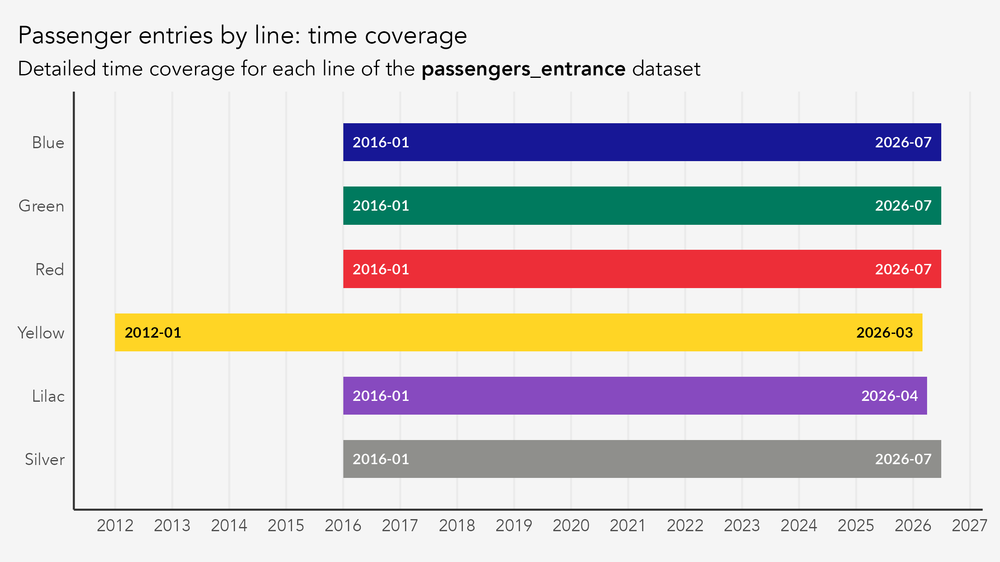
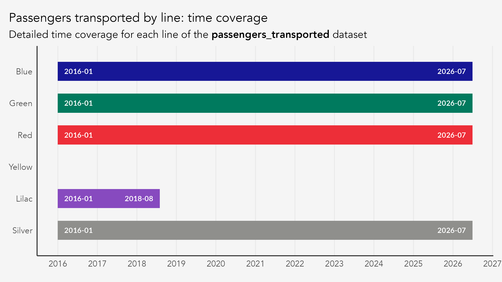
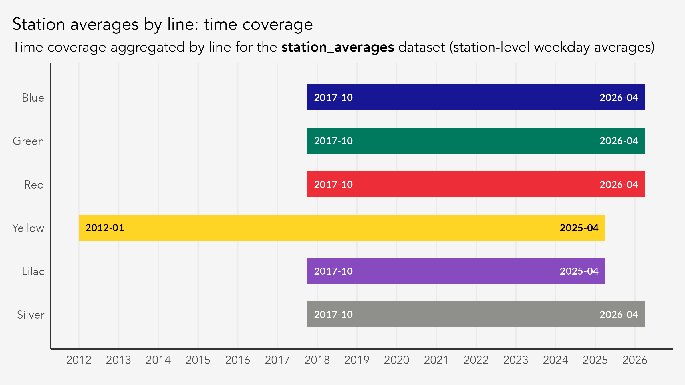
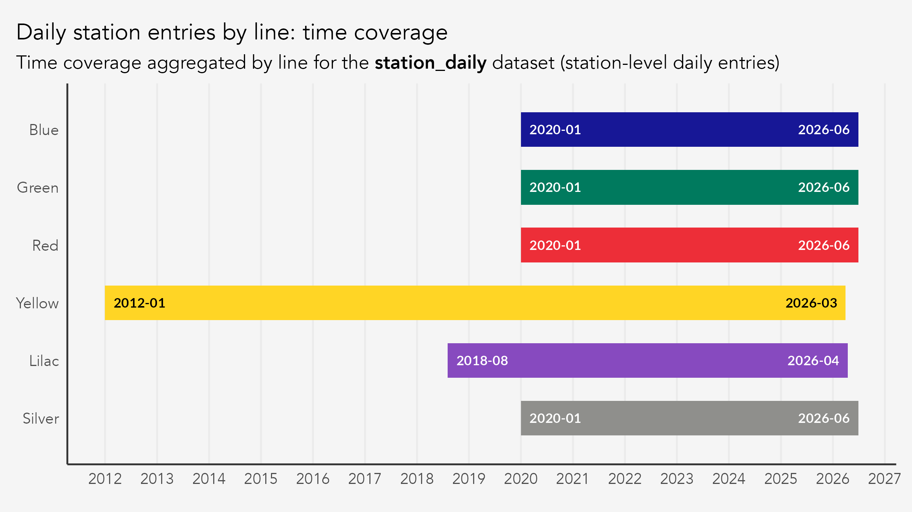

```{r}
#| label: setup
#| include: false
library(metrosp)
library(sf)
```
<style>
table {
    font-size: 0.8em;
}
</style>

This vignette documents the core datasets shipped with `metrosp`. It details what each dataset contains, where the data comes from, and the caveats you should know before analyzing it. For the auxiliary lookup tables, see the help pages (`?metro_colors`, `?station_inauguration`, `?calendar_spo`).

# Overview

The package ships four core datasets. Two measure passengers at the line level, and two at the station level.

| Dataset | Description | Unit | Time span | Frequency | Package name |
|------------|------------|------------|------------|------------|------------|
| Passenger entries by line | Passenger entries, measured by the station's turnstiles, aggregated by day-type metrics. | Passengers | 2012--2026 | Monthly | `passengers_entrance` |
| Transported passengers per line | Number of transported passengers, measured by the station's turnstiles plus transfers between lines at interchange stations. | Thousand passengers | 2017--2026 | Monthly | `passengers_transported` |
| Station-level averages | Average business day passenger entries per station, aggregated by month. | Passengers | 2012--2026 | Monthly | `station_averages` |
| Station-level daily | Daily passenger entries at each station. | Passengers | 2012--2026 | Daily | `station_daily` |

Three of these datasets count **individual passengers** and cover every metro line. `passengers_transported` is the exception: it reports **thousands of passengers**, has no data for Line 4, and covers Line 5 only through August 2018. Multiply its `value` by 1000 before comparing it with the other datasets.

A "passenger entry" is a passenger who crossed the station's turnstile gates. A "transported passenger" is one who either crossed the turnstile gates or changed between lines at an interchange station, so transported counts are always equal to or greater than entry counts.

The table simplifies in two ways. First, the time span varies by line; each dataset section below gives the window per line. Second, the producer changes over time: METRO ran Line 5 at first and later handed it to ViaMobilidade.

## Data vintage

These datasets are a fixed snapshot, current through June 2026. The snapshot is regenerated when the column schema changes, not when new months are published upstream, so results computed from a given package version stay reproducible. METRO publishes irregularly and revises past years, so the figures here drift from the source over time. Freshly rebuilt data is published on every pipeline run to the `data-latest` [GitHub release](https://github.com/viniciusoike/metrosp/releases).

# Data producers

This package aggregates and harmonizes data from three different data producers: 1) the METRO transparency website; 2) Insper's Dataverse; and 3) São Paulo's public geodata repository, GeoSampa.

I use the term **data producer** rather than source to emphasize the processing this package ships: combining these datasets takes a lot of cleaning. The `targets` package orchestrates the full pipeline, which lives in the package's [GitHub repository](https://github.com/viniciusoike/metrosp/tree/main/data-raw).

| Dataset | Granularity | Producer | Time span | Line Coverage |
|---------------|---------------|---------------|---------------|---------------|
| `passengers_entrance` | line $\times$ month $\times$ metric | METRO + Dataverse | 2012--2026 | All |
| `passengers_transported` | line $\times$ month $\times$ metric | METRO | 2017--2026 | Lines 1, 2, 3, 5, and 15 |
| `station_averages` | station $\times$ month | METRO + Dataverse | 2012--2026 | All |
| `station_daily` | station $\times$ day | METRO + Dataverse | 2012--2026 | All |
| `lines` | line (spatial) | GeoSampa | Last updated: 2026/04/10 | All |
| `stations` | station (spatial) | GeoSampa | Last updated: 2026/04/10 | All |

## METRO SP transparency portal {#source-metro}

The Companhia do Metropolitano de São Paulo (a.k.a. METRÔ) publishes monthly demand reports at its [data transparency portal](https://transparencia.metrosp.com.br/dataset/demanda). Reports cover Lines 1 (Azul/Blue), 2 (Verde/Green), 3 (Vermelha/Red), 5 (Lilás/Lilac, until Jul 2018), and 15 (Prata/Silver), and are available from January 2017 onward. Values are reported in thousands (*milhares*).

Before 2020, these monthly reports were published as monthly PDF and `csv` files. The `csv` files start in October 2017; the first nine months of 2017 exist only as PDFs (see [2017 source formats](#source-formats-2017)). Each individual file contains a table (metric) from a specific year-month. There were three pieces of information available for each month: 1) the average number of entries in each station, on business days (`station_averages`); 2) the number of passenger entries per line (`passengers_entrance`); and 3) the number of transported passengers per line (`passengers_transported`).

From 2020 onwards, the monthly reports started to be published in annual PDF and `csv` files that are updated monthly. Also, a new report was published that contained the daily number of entrances per station (`station_daily`).

Both the PDF and `csv` files are poorly structured, which is part of why `metrosp` exists. The data is public but hard to use: the format, encoding, and layout of the `csv` files shift from release to release, so each year and report needs its own import strategy. That fragility has produced processing errors in the past. The pipeline now runs a set of checks on every build, but errors may still slip through — if you find one, please open an issue on the [GitHub repository](https://github.com/viniciusoike/metrosp/issues).

Going back to the datasets, it's important to note that each monthly passenger report breaks demand into five day-type metrics: total (monthly aggregate), average on business days, average on Saturdays, average on Sundays, and daily peak (maximum within the month). These are aggregated by METRO.

Daily station-level data (one row per station per day) is available from 2020 onwards. Stations with integrations to other lines always present the total daily entrance plus the transfers from other lines. For example, Paraíso from Line 1 presents all station entries plus transfers from Line 2. Paraíso from Line 2 presents all entries in the station plus transfers from Line 1.

Finally, METRO produces data for lines 1, 2, 3, 5, and 15. Line 5 was initially operated by METRO SP and later passed on to ViaMobilidade (see below).

## Insper Dataverse {#source-dataverse}

Lines 4 (Amarela/Yellow, operated by ViaQuatro) and 5 (Lilás/Lilac, operated by ViaMobilidade from August 2018) are not published on the METRO portal. Ridership data for these lines comes from the [Insper Dataverse](https://doi.org/10.60873/FK2/UTGQ0I), starting January 2012 (Line 4) and August 2018 (Line 5). Transported counts are **not available** for Lines 4 or 5.

Unlike the METRO data, Dataverse counts are not rounded to the nearest thousand. The ETL therefore multiplies METRO values by 1,000, so every dataset that combines the two sources reports individual passengers. `passengers_transported` draws on METRO alone and keeps the source unit, thousands of passengers.

The `station_averages` dataset for Lines 4 and 5 is derived from `station_daily` using the `bizdays` package with the "Brazil/ANBIMA" calendar, which tracks days when the B3 stock exchange operates in São Paulo. That calendar closely mirrors the city's business-day schedule, with one caveat: since 2022 B3 closes only for national holidays, not for municipal or state ones such as the 9th of July. The package ships `calendar_spo`, a São Paulo calendar that does mark those holidays, for analyses that need the finer distinction.

## GeoSampa {#source-geosampa}

Spatial geometries for metro and commuter train (CPTM) lines and stations come from [GeoSampa](https://geosampa.prefeitura.sp.gov.br/), the City of São Paulo's open geospatial platform. The data includes both currently operating infrastructure and planned future expansions.

# Core datasets

## `passengers_entrance`

This table shows the number of monthly passenger entries aggregated by metro line and day-type metrics.

---

### Columns and definitions

| Column | Type | Description |
|------------------------|------------------------|------------------------|
| `date` | Date | First day of the month |
| `line_number` | integer | Line identifier (1, 2, 3, 4, 5, 15, or 99 for network total) |
| `metric_abb` | character | Metric code: `total`, `mdu`, `msa`, `mdo`, `max` |
| `value` | numeric | Passenger count |
| `metric` | character | Metric label in English |
| `metric_pt` | character | Metric label in Portuguese |
| `line_name` | character | Line color in English |
| `line_name_pt` | character | Line color in Portuguese |
| `year` | integer | Calendar year |
: Column descriptions and column types


The table below shows the first few rows of each column.

```{r}
dplyr::glimpse(passengers_entrance)
```

This table is organized by day-type metrics that are defined below.

### Metrics

| Code    | English                       | Portuguese           |
|---------|-------------------------------|----------------------|
| `total` | Total passengers in the month | Total                |
| `mdu`   | Average on business days      | Média dos Dias Úteis |
| `msa`   | Average on Saturdays          | Média dos Sábados    |
| `mdo`   | Average on Sundays            | Média dos Domingos   |
| `max`   | Daily peak                    | Máxima Diária        |
: Metric definitions

### Time coverage by line

The time coverage of this dataset varies by line. End dates below are those of the shipped snapshot, not of the upstream source.

{fig-alt="Horizontal bar chart showing each metro line's data coverage window in the passengers_entrance dataset. Lines 1, 2, 3, and 15 run from October 2017 to June 2026; Line 5 from October 2017 to April 2026; Line 4 from January 2012 to March 2026."}

| Line | Source | From | To |
|------------------|------------------|------------------|------------------|
| 1 -- Blue | METRO portal | Jan 2017 | Jun 2026 |
| 2 -- Green | METRO portal | Jan 2017 | Jun 2026 |
| 3 -- Red | METRO portal | Jan 2017 | Jun 2026 |
| 4 -- Yellow | Dataverse | Jan 2012 | Mar 2026 |
| 5 -- Lilac | METRO (Jan 2017--Jul 2018), Dataverse (Aug 2018+) | Jan 2017 | Apr 2026 |
| 15 -- Silver | METRO portal | Jan 2017 | Jun 2026 |
| 99 -- System | METRO portal | Jan 2017 | Jun 2026 |
: Time coverage by line

The Dataverse source lags METRO, so Lines 4 and 5 end earlier than the rest.

## `passengers_transported`

This table shows the number of monthly passengers transported, aggregated by metro line and day-type metric. It counts passengers entering the station through the turnstile gates plus passengers changing between lines. Values are in **thousands of passengers**, unlike every other dataset here.

---

### Columns and definitions

| Column | Type | Description |
|------------------------|------------------------|------------------------|
| `date` | Date | First day of the month |
| `line_number` | integer | Line identifier (1, 2, 3, 5, 15, or 99 for network total) |
| `metric_abb` | character | Metric code: `total`, `mdu`, `msa`, `mdo`, `max` |
| `value` | numeric | Passenger count (in thousands) |
| `metric` | character | Metric label in English |
| `metric_pt` | character | Metric label in Portuguese |
| `line_name` | character | Line color in English |
| `line_name_pt` | character | Line color in Portuguese |
| `year` | integer | Calendar year |
: Column descriptions and column types

The table below shows the first few rows of each column.

```{r}
dplyr::glimpse(passengers_transported)
```

This dataset uses the same day-type metrics as `passengers_entrance` (see Metrics above).

### Time coverage by line

The time coverage of this dataset varies by line. End dates below are those of the shipped snapshot, not of the upstream source.

{fig-alt="Horizontal bar chart showing each metro line's data coverage window in the passengers_transported dataset. Lines 1, 2, 3, and 15 run from October 2017 to June 2026. Line 5 covers October 2017 to August 2018 only. Line 4 has no bar at all, showing it is entirely absent from this dataset."}

| Line | Source | From | To |
|------------------|------------------|------------------|------------------|
| 1 -- Blue | METRO portal | Jan 2017 | Jun 2026 |
| 2 -- Green | METRO portal | Jan 2017 | Jun 2026 |
| 3 -- Red | METRO portal | Jan 2017 | Jun 2026 |
| 5 -- Lilac | METRO portal | Jan 2017 | Aug 2018 |
| 15 -- Silver | METRO portal | Jan 2017 | Jun 2026 |
| 99 -- System | METRO portal | Jan 2017 | Jun 2026 |
: Time coverage by line

Line 4 is absent entirely. The Dataverse source does not include transported counts for Lines 4 or 5.

## `station_averages`

Monthly average weekday passenger entries per station.

---

### Columns and definitions

| Column          | Type      | Description                            |
|-----------------|-----------|----------------------------------------|
| `date`          | Date      | First day of the month                 |
| `line_number`   | integer   | Line identifier                        |
| `station_name`  | character | Full station name                      |
| `avg_passenger` | numeric   | Average weekday (business day) entries |
| `line_name`     | character | Line color in English                  |
| `line_name_pt`  | character | Line color in Portuguese               |
| `year`          | integer   | Calendar year                          |
: Column descriptions and column types

The table below shows the first few rows of each column.

```{r}
dplyr::glimpse(station_averages)
```

Only the weekday average metric is available at the station level. For line-level data with all five metrics, see `passengers_entrance`.

### Time coverage by line

The time coverage of this dataset varies by line. End dates below are those of the shipped snapshot, not of the upstream source.

{fig-alt="Horizontal bar chart showing each metro line's data coverage window in the station_averages dataset, aggregated by line. Lines 1, 2, 3, and 15 run from October 2017 to June 2026; Line 5 from October 2017 to April 2026; Line 4 from January 2012 to March 2026."}

| Line | Source | From | To |
|------------------|------------------|------------------|------------------|
| 1 -- Blue | METRO portal | Jan 2017 | Jun 2026 |
| 2 -- Green | METRO portal | Jan 2017 | Jun 2026 |
| 3 -- Red | METRO portal | Jan 2017 | Jun 2026 |
| 4 -- Yellow | Dataverse | Jan 2012 | Mar 2026 |
| 5 -- Lilac | METRO (Jan 2017--Jul 2018), Dataverse (Aug 2018+) | Jan 2017 | Apr 2026 |
| 15 -- Silver | METRO portal | Jan 2017 | Jun 2026 |
: Time coverage by line

## `station_daily`

Daily passenger entries at each station.

---

### Columns and definitions

| Column | Type | Description |
|------------------------|------------------------|------------------------|
| `date` | Date | Date of observation |
| `line_number` | integer | Line identifier |
| `station_name` | character | Full station name |
| `passengers` | numeric | Daily passenger entries |
| `line_name` | character | Line color in English |
| `line_name_pt` | character | Line color in Portuguese |
| `station_code` | character | Three-letter METRO abbreviation (`NA` for Lines 4--5) |
| `year` | integer | Calendar year |
: Column descriptions and column types

The table below shows the first few rows of each column.

```{r}
dplyr::glimpse(station_daily)
```

### Time coverage by line

The time coverage of this dataset varies by line. End dates below are those of the shipped snapshot, not of the upstream source.

{fig-alt="Horizontal bar chart showing each metro line's data coverage window in the station_daily dataset, aggregated by line. Lines 1, 2, 3, and 15 run from January 2020 to June 2026; Line 4 from January 2012 to March 2026; Line 5 from August 2018 to April 2026."}

| Line | Source | From | To |
|------------------|------------------|------------------|------------------|
| 1 -- Blue | METRO portal | Jan 2020 | Jun 2026 |
| 2 -- Green | METRO portal | Jan 2020 | Jun 2026 |
| 3 -- Red | METRO portal | Jan 2020 | Jun 2026 |
| 4 -- Yellow | Dataverse | Jan 2012 | Mar 2026 |
| 5 -- Lilac | Dataverse | Aug 2018 | Apr 2026 |
| 15 -- Silver | METRO portal | Jan 2020 | Jun 2026 |
: Time coverage by line

# Spatial datasets

The `lines` and `stations` datasets are `sf` objects in WGS 84 (EPSG:4326), sourced from [GeoSampa](#source-geosampa). Both include currently operating and planned future infrastructure for METRO SP and CPTM.

## lines

```{r}
dplyr::glimpse(lines)
```

| Column | Type | Description |
|------------------------|------------------------|------------------------|
| `line_number` | integer | Official line number |
| `line_name_pt` | character | Line color in Portuguese |
| `line_name` | character | Line color in English |
| `company_name` | character | Operator (Metrô, ViaQuatro, ViaMobilidade, CPTM) |
| `type` | character | `"metro"` (underground) or `"train"` (CPTM commuter rail) |
| `status` | character | `"current"` (operating) or `"future"` (planned) |
| `geometry` | LINESTRING | Route geometry |

## stations

```{r}
dplyr::glimpse(stations)
```

| Column         | Type      | Description               |
|----------------|-----------|---------------------------|
| `station_name` | character | Station name (title case) |
| `line_number`  | integer   | Line number               |
| `line_name_pt` | character | Line color in Portuguese  |
| `line_name`    | character | Line color in English     |
| `company_name` | character | Operator                  |
| `type`         | character | `"metro"` or `"train"`    |
| `status`       | character | `"current"` or `"future"` |
| `geometry`     | POINT     | Station location          |

Transfer stations (e.g., Sé, Paraíso, Ana Rosa) appear once per line they serve.

# Auxiliary datasets

Three lookup tables support the core datasets.

- **`metro_colors`** --- named character vector of official hex color codes for the six lines with ridership data (e.g., `metro_colors["Blue"]` returns `"#171796"`). Useful for consistent plot styling with `scale_color_manual()`.
- **`station_inauguration`** --- commercial opening dates by station, with a `ramp_up_end` column marking the end of the initial ramp-up window. See [Station openings](#station-openings).
- **`calendar_spo`** --- daily calendar for the city of São Paulo, 2012--2030, flagging national, state, and municipal holidays and business days. Join on `date` to build business-day aggregates from `station_daily`.

Line numbers and their Portuguese/English names are already included as columns on every passenger and station dataset, and the full network line list (including planned and CPTM lines) is available in `lines`.

# Data notes and caveats

## Entrance vs. transported {#entrance-vs-transported}

The METRO source files define these terms as:

- **Entrada de passageiros** (*passenger entries*): passengers entering through the turnstile gates (*linha de bloqueios*). This is a station-level measurement.
- **Passageiros transportados** (*passengers transported*): the sum of turnstile entries **plus** transfer passengers between lines at interchange stations (e.g. Sé, Paraíso, Ana Rosa, and Vila Prudente). This is a system-level measurement that better captures total demand but double-counts passengers who transfer.

The original Portuguese footnote reads:

> Corresponde à soma das entradas pela linha de bloqueios com as transferências entre linhas nas estações [...].

## Station-level transfer counting {#station-transfers}

At interchange stations, the METRO source reports separate figures per line. For example, at Paraíso (Lines 1 and 2):

- Line 1 figure = passengers boarding Line 1 + transfers from Line 2
- Line 2 figure = passengers boarding Line 2 + transfers from Line 1

This means station-level totals at interchange stations are **not** double-counted within a single line, but summing across lines at the same interchange would overcount. The affected stations and their lines are listed below. Note that some of these stations have interchange with the train (CPTM) network.

| Station               | Lines                |
|-----------------------|-----------------------|
| Ana Rosa              | 1, 2                 |
| Luz                   | 1, 4, 10, 11 (CPTM)   |
| Paraíso               | 1, 2                 |
| Santa Cruz            | 1, 5                 |
| Sé                    | 1, 3                 |
| Chácara Klabin        | 2, 5                  |
| Consolação            | 2, 4                  |
| Tamanduateí           | 2, 10 (CPTM)          |
| Vila Prudente         | 2, 15                 |
| Brás                  | 3, 10, 11, 12 (CPTM)  |
| Corinthians-Itaquera  | 3, 11 (CPTM)          |
| Palmeiras-Barra Funda | 3, 7, 8 (CPTM)        |
| República             | 3, 4                  |
| Tatuapé               | 3, 11, 12 (CPTM)      |
: Interchange stations and their lines

## Line 5 ownership change {#line5-change}

Line 5 (Lilás) was originally operated by METRO SP. On August 4, 2018, it was handed over to ViaMobilidade under a concession contract. This affects the data in two ways:

1.  **Source switch**: from January 2017 through July 2018, Line 5 data comes from the METRO transparency portal. From August 2018 onward, it comes from the Insper Dataverse (ViaMobilidade/Insper partnership).
2.  **Transported counts end**: the METRO portal has Line 5 transported data through August 2018, the month of the ownership handover. The Dataverse does not provide transported counts, so `passengers_transported` has no Line 5 data afterward.

## Station openings during the data window {#station-openings}

Several stations opened during the time coverage of the datasets, which produces step changes and ramp-up periods when a station or line runs well below its steady state. New METRO lines often operate at reduced rates in their first months, on shorter timetables or fewer days of the week — some close on weekends for testing.

The `station_inauguration` dataset lists opening dates by station (see `?station_inauguration`). It covers the stations that opened within or near the data window, and remains incomplete.

### Line 15 Sunday closures

In February and March 2018, Line 15 (Prata) was closed on Sundays for control system testing. Sunday averages (`mdo`) for these months reflect zero or near-zero ridership, which is a testing artifact rather than demand.

## Rounding in station averages

The METRO source rounds station-level averages to the nearest thousand. The sum of individual station values may not equal the line total due to this rounding. The original note states:

> O total da linha pode ser diferente da soma das estações devido ao arredondamento.

## Lines 4 and 5: station codes

The `station_code` column (three-letter abbreviation) is only available for METRO-operated lines (1, 2, 3, 15). Lines 4 and 5 have `station_code = NA` because these abbreviations are internal to METRO SP and not used by ViaQuatro/ViaMobilidade.

## 2017 source formats {#source-formats-2017}

The METRO transparency portal publishes January through September 2017 only as PDFs; machine-readable CSVs begin in October 2017. Figures for those first nine months are therefore extracted from the PDF reports, which are harder to parse than the CSVs and carry a correspondingly higher risk of transcription error. If a 2017 figure looks wrong, please open an issue.

## Trailing months and NA values

Months (or days, for `station_daily`) beyond the last published data point for each line are trimmed during assembly, so the datasets do not contain unpublished trailing `NA` rows. Interior `NA` values --- for example, days when Line 15 (Silver) was not operating --- are preserved as-is.

# Source attribution

The datasets in this package are heavily processed and curated, so cite the package as well as the original producers. Run `citation("metrosp")` for the entry.
